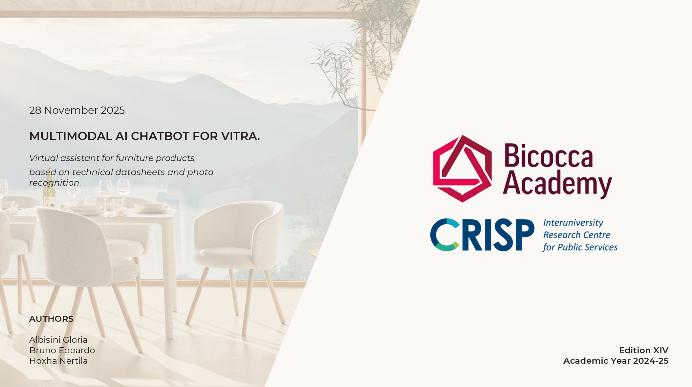

# Online Furniture Shopping Chatbot

A multimodal academic prototype for online furniture shopping that combines
technical-document retrieval, large language models, and visual object
detection in a single conversational interface.

The assistant can answer product questions using bilingual technical
datasheets and recognize supported furniture categories from uploaded images.

## Project presentation

The complete project concept, architecture, methodology, experiments, and
results are documented in the presentation below.

[](docs/Chatbot_furniture_ecommerce_presentation.pdf)

**[Open the complete PDF presentation](docs/Chatbot_furniture_ecommerce_presentation.pdf)**

> **Project status:** academic proof of concept. The repository is not a
> production-ready e-commerce or customer-service system.

## Academic context

The project was developed as a master's course exercise during academic year
2024–2025. It investigates how retrieval-augmented generation (RAG), large
language models (LLMs), and computer vision can support customers and design
professionals when navigating a complex furniture catalogue.

The prototype focuses on immediate and document-grounded answers about product
dimensions, materials, colours, fabrics, variants, and intended use. From a
business perspective, the same architecture could reduce repetitive
customer-care requests, improve consistency with official documentation, and
support product discovery in digital or showroom contexts.

## Case study and transferability

The prototype was originally developed using the Vitra website as an academic
case study. Product images and technical datasheets were collected from
materials that were publicly accessible for online consultation at the time of
the project. They were used to explore the technical feasibility of combining
document-grounded question answering with visual product recognition; this
repository is not affiliated with, sponsored by, or endorsed by Vitra.

The underlying pipeline is not specific to one company or furniture catalogue.
It can be adapted to any e-commerce platform that makes suitable product images
and structured technical documentation available. In a different domain, the
same workflow can be used to collect and annotate images, parse product sheets,
generate metadata-enriched embeddings, retrieve relevant specifications, and
connect visual recognition with a conversational shopping assistant. Practical
reuse would require domain-specific data preparation, metadata rules, model
training, evaluation, and appropriate permission to process and redistribute
the source materials.

## Objectives

The project aims to:

- transform bilingual furniture datasheets into a searchable knowledge base;
- retrieve product-specific information by semantic similarity and metadata;
- generate answers grounded only in the retrieved technical context;
- recognize supported furniture categories from real-world or catalogue images;
- compare one-stage and two-stage object-detection approaches;
- combine text chat and image upload in a Streamlit interface;
- evaluate both retrieval quality and visual-detection performance.

## System architecture

The prototype contains two processing branches that converge in the Streamlit
application:

```text
Technical PDFs
    → parsing
    → chunking and metadata
    → Sentence-BERT embeddings
    → Chroma vector database
    → semantic retrieval
    → controlled LLM prompt
    → grounded answer

Furniture images
    → image collection
    → annotation and dataset preparation
    → YOLO11n / Faster R-CNN training
    → object detection
    → recognized product category

Text question + uploaded image
    → Streamlit multimodal chatbot
```

## RAG pipeline

### Document processing

Technical PDF documents in English and Italian are loaded page by page with
`PyPDFLoader`. The extracted text is divided with
`RecursiveCharacterTextSplitter` using:

- chunk size: 1,000 characters;
- chunk overlap: 100 characters.

Each chunk receives three metadata fields:

| Metadata | Purpose |
|---|---|
| `product` | Product name derived from the PDF filename |
| `language` | English or Italian, derived from the `-EN` or `-IT` suffix |
| `section` | Heuristic category such as dimensions, materials, fabrics, colours, or use |

### Embeddings and vector storage

The pipeline uses `sentence-transformers/all-MiniLM-L6-v2` to convert every
chunk into a 384-dimensional embedding. Text, embeddings, and metadata are
stored in a persistent Chroma database supporting nearest-neighbour search and
metadata filtering.

### Retrieval and answer generation

The user query is embedded with the same Sentence-BERT model. Chroma retrieves
the most similar chunks, normally using a top-k range of 5–10 results. Language
and recognized-product metadata can narrow the search.

The final prompt contains:

1. instructions to rely only on the supplied context;
2. the retrieved chunks and their metadata;
3. the user's question;
4. the expected answer section.

The experimental implementation uses `gpt-4.1-mini` to formulate the final
technical response.

### RAG evaluation

The evaluation script includes:

- **Recall@k** — whether relevant chunks appear among the first k results;
- **Reciprocal Rank** — how highly the first relevant chunk is ranked;
- **Cosine similarity** — semantic proximity between the query and retrieved chunks;
- **Faithfulness** — LLM-based assessment of answer consistency with the supplied context.

## Computer-vision pipeline

The visual branch covers ten furniture categories. The presentation reports an
initial image collection of 1,627 examples, followed by annotation and a 60/40
training-validation split. The repository may contain later or expanded local
exports, so local file counts can differ from the original experiment.

### YOLO11n

YOLO11n provides the one-stage detector used by the chatbot. The experiment
uses:

- 100 epochs;
- image size of 640 pixels;
- batch size of 8;
- Adam optimizer;
- a nano architecture with approximately 2.6 million parameters.

The presentation reports an overall `mAP@50` of approximately `0.923` across
the supported categories.

### Faster R-CNN with ResNet-50 and FPN

The second experiment evaluates a two-stage detector composed of:

- a ResNet-50 feature-extraction backbone;
- a Feature Pyramid Network for multi-scale features;
- a Region Proposal Network for candidate boxes;
- ROI Align for region-level feature alignment;
- classification and bounding-box regression heads.

This model is retained as an experimental comparison with YOLO11n rather than
the detector used by the Streamlit application.

## Streamlit application

The interface integrates three components:

- **YOLO11 computer vision** to recognize a furniture category from an image;
- **RAG retrieval** to obtain relevant information from indexed datasheets;
- **LLM generation** to formulate a coherent answer from retrieved chunks.

The application keeps the chat history in the Streamlit session and avoids
reprocessing the same uploaded image repeatedly.

## Repository structure

```text
Online-Furniture-Shopping-Chatbot/
│
├── README.md
├── requirements.txt
├── .gitignore
│
├── src/
│   ├── 00_download_image_dataset.py
│   ├── 01_build_chroma_index.py
│   ├── 02_evaluate_rag.py
│   ├── 03a_train_yolo11.py
│   ├── 03b_train_faster_rcnn.py
│   └── 04_streamlit_app.py
│
├── notebooks/
│   ├── 03a_train_yolo11.ipynb
│   └── 03b_train_faster_rcnn.ipynb
│
├── data/
│   ├── raw/
│   │   ├── product_images/
│   │   └── rag_documents/
│   └── processed/
│       └── object_detection/
│
├── models/
│   ├── chroma_db/
│   ├── faster_rcnn/
│   └── yolo11/
│
├── outputs/
│   ├── figures/
│   ├── rag/
│   └── training/
│
├── docs/
│   ├── Chatbot_furniture_ecommerce_cover.png
│   ├── Chatbot_furniture_ecommerce_presentation.pdf
│   └── project_logo.png
│
└── secrets/
    └── key.txt
```

The `secrets/` directory, large datasets, vector database, training runs, and
model weights are excluded from Git through `.gitignore`.

## Script inventory

| Script | Purpose |
|---|---|
| `00_download_image_dataset.py` | Collects product images from web image search results and stores them by query. |
| `01_build_chroma_index.py` | Parses bilingual PDFs, creates metadata-enriched chunks, generates embeddings, and rebuilds the persistent Chroma collection. |
| `02_evaluate_rag.py` | Runs the RAG workflow and evaluates retrieval and answer faithfulness. |
| `03a_train_yolo11.py` | Colab-oriented YOLO11 training and validation export. |
| `03b_train_faster_rcnn.py` | Colab-oriented Faster R-CNN training and COCO evaluation export. |
| `04_streamlit_app.py` | Runs the multimodal chat and image-recognition interface. |

## Installation

### Recommended environment

- Python 3.10 or 3.11;
- Windows, Linux, or Google Colab;
- a virtual environment;
- a CUDA-capable GPU for practical detector training times.

Create and activate a virtual environment on Linux or macOS:

```bash
python -m venv .venv
source .venv/bin/activate
python -m pip install --upgrade pip
pip install -r requirements.txt
```

On Windows PowerShell:

```powershell
python -m venv .venv
.\.venv\Scripts\Activate.ps1
python -m pip install --upgrade pip
pip install -r requirements.txt
```

Detectron2 installation depends on the operating system, PyTorch release, CUDA
toolkit, and compiler availability. The requirement uses the upstream Git
repository, but a compatible environment may still require platform-specific
setup.

## Configuration

The RAG evaluation and Streamlit application require an OpenAI API key. Store
the key locally as a single line in:

```text
secrets/key.txt
```

Never commit a real API key. The complete `secrets/` directory is ignored by
Git.

The application also expects these local artifacts:

```text
models/yolo11/best.pt
models/chroma_db/
data/raw/rag_documents/
docs/project_logo.png
```

## Suggested execution order

The intended pipeline order is:

```text
00  collect product images
01  parse documents and build the Chroma index
02  evaluate retrieval and answer generation
03a train and validate YOLO11 in a compatible notebook environment
03b train and evaluate Faster R-CNN in a compatible notebook environment
04  launch the Streamlit application
```

Build or rebuild the vector index:

```bash
python src/01_build_chroma_index.py
```

Run the RAG evaluation:

```bash
python src/02_evaluate_rag.py
```

Launch the application from the repository root:

```bash
streamlit run src/04_streamlit_app.py
```

## Important implementation notes

- The project remains a file-based academic prototype rather than an installable Python package.
- The computer-vision `.py` files were exported from Colab notebooks and retain notebook-specific commands such as `!pip` and Google Drive mounting.
- Use the files under `notebooks/` for computer-vision training unless the exported scripts are adapted for a standard Python runtime.
- Rebuilding the Chroma collection replaces the existing collection with a newly generated index.
- Model weights, the vector database, image datasets, and training runs are intentionally kept outside normal Git tracking.
- External API availability, pricing, quotas, and model behaviour can change over time.

## Limitations

- The prototype covers only a limited number of furniture categories and technical documents.
- Retrieval quality depends on filename consistency, metadata heuristics, and document coverage.
- The language detector in the interface uses a lightweight heuristic.
- The image dataset is limited in size and diversity.
- Visual performance may decrease for unusual viewpoints, lighting, occlusion, or unseen environments.
- RAG metrics are demonstrated on a limited evaluation setup rather than a comprehensive benchmark.
- The application does not include production authentication, monitoring, observability, or security controls.

## Future development

Planned extensions include:

- expanding coverage to a broader furniture catalogue;
- increasing image diversity and refining object detection;
- introducing a larger and versioned RAG evaluation set;
- improving language, product, and section detection during retrieval;
- adding automated tests and reproducible experiment tracking;
- introducing data and model versioning;
- integrating CAD or 3D product assets;
- strengthening production security and API-key management.

## Academic acknowledgement

Developed as an academic project during academic year 2024–2025. The linked
presentation contains the original academic acknowledgements and authorship
information.

## Publication and third-party materials

The linked presentation, cover, technical documents, product images, dataset
exports, trademarks, and logos may contain third-party material. Their presence
does not imply that this repository is an official product or an endorsed
commercial system.

Before publishing or assigning an open-source licence, verify ownership and
redistribution rights for:

- source code and notebook exports;
- technical datasheets and product images;
- annotated datasets and external dataset exports;
- trained model weights;
- logos, presentation assets, trademarks, and other third-party content.

## Licence

No open-source licence is assigned by default.
